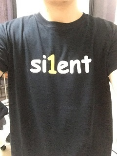
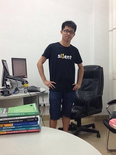
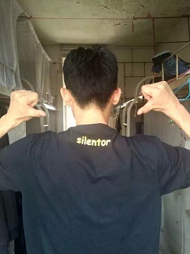
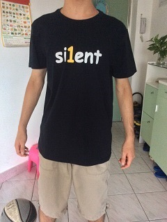

# silent


> Be a silent, static blog

Live Demo: <http://fritx.github.io/silent><br>
Also, a branch by @Jayin: [Meizhuo/silentor](https://github.com/Meizhuo/silentor)

## Features

### Easy: Writing in Markdown

> Markdown makes contents more **focused**

Or you can use any other renderer instead

### Flexible: Special Page Management

> With only **1** folder, do it yourself

Everything is a **page**, and every page is a **file**

### Lightweight: You Can't Imagine

> 1 html, 1 ico, 1 css and 1 js, totally **7K** (excluding jquery & marked)

```plain
- blog/
  - p/ (your own things, free to handle)
    - posts/
      - my-js-book/
        - index.md
        - part-1.md
        - part-2.md
      - what-a-funny-day.md
      - why-i-use-js.md
    - sidebar.md
    - aboutme.md
    - avatar.jpg
  - vendor/ (built-in stuffs)
    - blog.css
    - blog.js
    - ...
  - favicon.ico
  - index.html
```

### Responsive: All is Well

> Never mind the screens


&nbsp;&nbsp;&nbsp;&nbsp;


## Silent Fans

> Thank you!

- [Jayin's Blog](http://jayin.github.io)
- [Derek's Blog](http://derekgame2013.github.io/blog/)
- [Huang's Blog](http://huangruichang.github.io)
- [Jason's Blog](http://jacsonlee.github.io/Blog/)
- [Jayden's Blog](http://iamjayden.github.io)
- [Fritx' Blog](http://fritx.github.io/blog/)

&nbsp;
&nbsp;
&nbsp;


&nbsp;
&nbsp;


&nbsp;
&nbsp;


## More..

> Rather than a framework or library, silent is more like a spirit - a culture. (says Huang)

- [Silent T-Shirt](http://udz.com/silent)
- [Silent One-Year Old](http://blog.fritx.me/?2015/05/silent-one-year-old)
