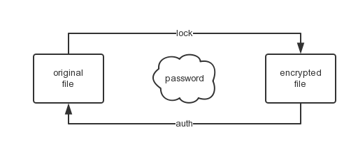
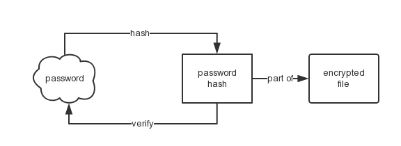
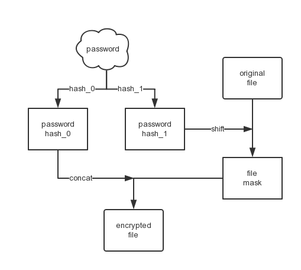
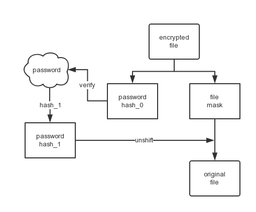

# Why I built fs-auth and how it works

*2015-01-11*

Several days ago I created a tool, which was named [fs-auth](https://github.com/fritx/fs-auth) and titled "auth beyond filesystem". That was an early idea.

1. In the beginning, I wanted to upload projects onto Github, with some sensitive files included (inappropriate but convinient, though), such as **connection config** or **password stuff**.
1. Later on, I wanted to encrypt, you know, some **personal files**.
1. Recently, I wanted to implement a file-based db (something like [lowdb](https://github.com/typicode/lowdb)), but with **user authentication**.

But I'd never figured out a way that is flat and straightforward, until fs-auth:

- encrypts files with passwords given
- auths and decrypts files with correct passwords
- fails auth with incorrect passwords

## So how does it work?

Here are our needs:

1. With a password required, original files get encrypted.
2. Encrypted files could verify the correct password.
3. With the correct password, encrypted files could be decrypted.
4. The password could not be figured out from encrypted files.
5. Even with original files, the password could not be figured out.

### Password Verification

We **hash the password** and prepend it to the encrypted file, for later verification.

Note that barely md5 is not safe enough. We use **combinations** of md5 and sha1 instead.

### Contents Encrypting/Decrypting

While encrypting, we shift each bit (simply increase its value) of file contents, using **another hash of the password** as key. While decrypting, we unshift (decrease) it.

## Entire Flows

### File Locking

### File Auth

