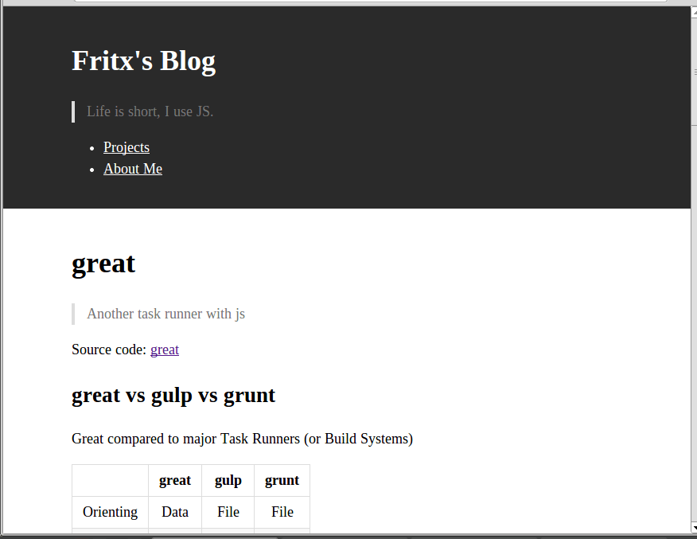
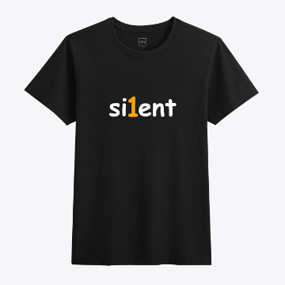

# silent 1.0-legacy

<a href="https://fritx.github.io/silent/"></a>&nbsp;&nbsp;<a href="https://github.com/fritx/silent"></a>
&nbsp;&nbsp;<a href="https://gitter.im/fritx"></a>&nbsp;&nbsp;<a href="https://www.npmjs.com/package/silent"></a>


> Be a silent, static blog

Live Demo: <https://fritx.github.io/silent><br>
Also, a branch by @Jayin: [Meizhuo/silentor](https://github.com/Meizhuo/silentor)

for silent 2.0, check [this](../silent_2.0/) out

## Features

### Easy: Writing in Markdown

> Markdown makes contents more **focused**

Or you can use any other renderer instead

### Flexible: Special Page Management

> With only **1** folder, do it yourself

Everything is a **page**, and every page is a **file**

### Lightweight: You Can't Imagine

> 1 html, 1 ico, 1 css and 1 js, totally **7K** (excluding jquery & marked)

```plain
- blog/
  - p/ (your own things, free to handle)
    - posts/
      - my-js-book/
        - index.md
        - part-1.md
        - part-2.md
      - what-a-funny-day.md
      - why-i-use-js.md
    - sidebar.md
    - aboutme.md
    - avatar.jpg
  - vendor/ (built-in stuffs)
    - blog.css
    - blog.js
    - ...
  - favicon.ico
  - index.html
```

### Responsive: All is Well

> Never mind the screens


&nbsp;&nbsp;&nbsp;&nbsp;



## Silent Fans

> Thank you!

- [Meizhuo's Blog](https://meizhuo.github.io/blog/)
- [Amen's Blog](https://linzx89757.github.io/blog/)
- [Jayin's Blog](https://v1.jayinton.com/blog/)
- [Derek's Blog](https://derekgame2013.github.io/blog/)
- [Huang's Blog](https://huangruichang.github.io)
- [Jason's Blog](https://jacsonlee.github.io/Blog/)
- [Jayden's Blog](https://iamjayden.github.io)
- [Fritx' Blog](https://blog.fritx.me/)

## More..

> Rather than a framework or library, silent is more like a spirit - a culture. (says Huang)

- [Silent One Year Old](../../2015/05/silent-one-year-old/)
- ~~[Silent T-Shirt](http://udz.com/silent)~~


