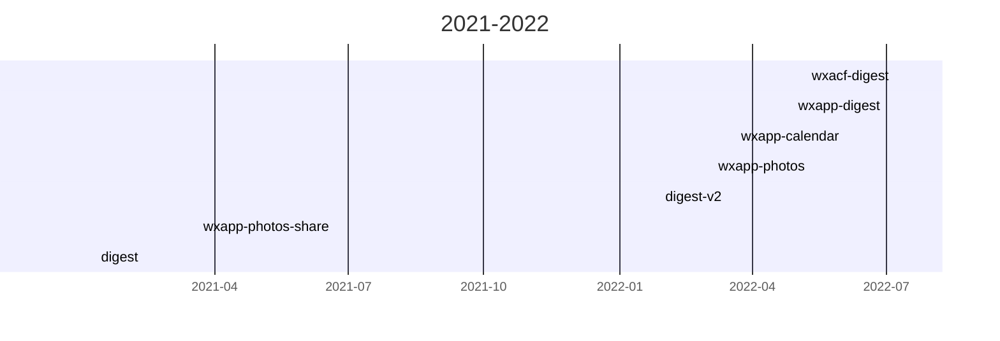
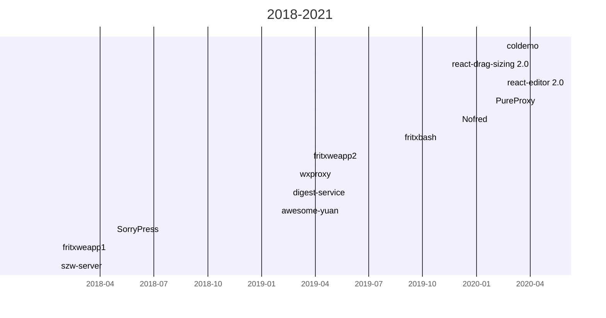
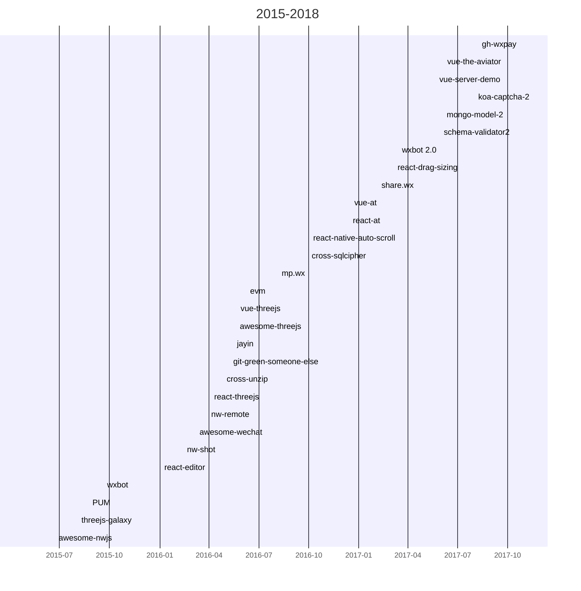
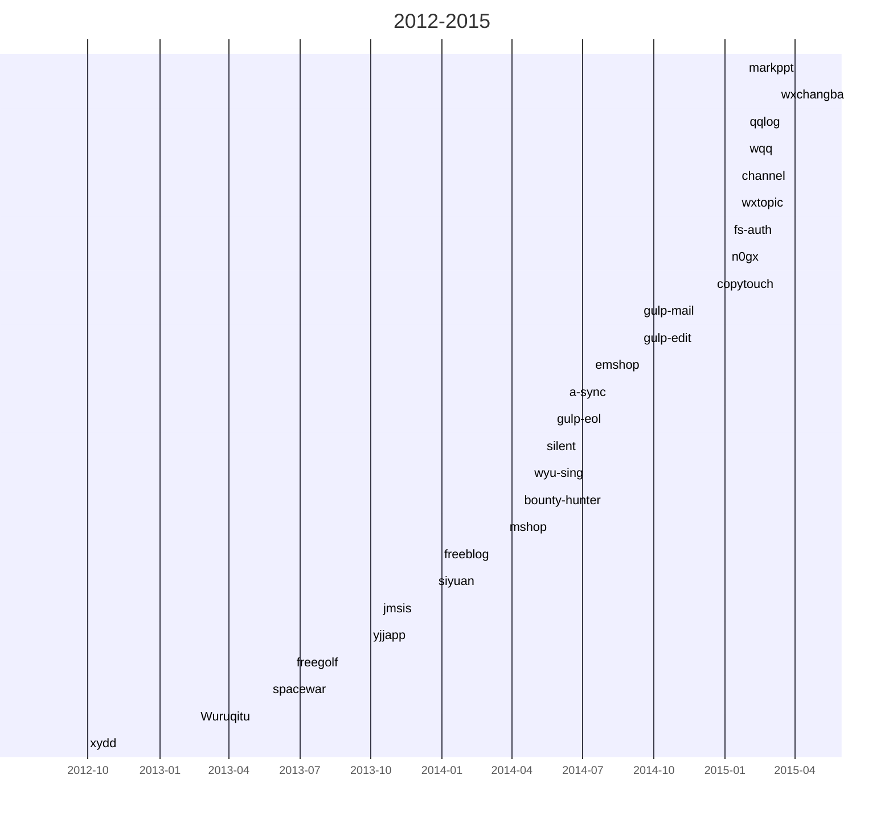

# Projects timeline

> All my projects on Github

```mermaid
gantt
  title 2021-2022
  axisFormat  %Y-%m
  wxacf-digest      :2022-07-07 , 2022-08-10
  wxapp-digest      :2022-07-01 , 2022-08-10
  wxapp-calendar      :2022-03-20 , 2022-07-19
  wxapp-photos      :2022-03-05 , 2022-05-05
  digest-v2       :2022-01-28 , 2022-05-28
  wxapp-photos-share      :2021-03-20 , 2021-04-04
  digest          :2021-01-10 , 2021-02-21
```

```mermaid
gantt
  title 2018-2021
  axisFormat  %Y-%m
  coldemo             :2020-04-22 , 2020-06-18
  react-drag-sizing 2.0      :2020-04-05 , 2020-04-06
  react-editor 2.0      :2020-02-16 , 2020-03-22
  PureProxy             :2020-01-27 , 2020-05-17
  Nofred             :2019-12-01 , 2019-12-14
  fritxbash             :2019-08-25 , 2019-12-15
  fritxweapp2           :2019-03-23 , 2019-08-21
  wxproxy               :2019-02-28 , 2019-04-06
  digest-service        :2019-02-16 , 2019-07-12
  awesome-yuan          :2019-01-28 , 2019-01-29
  SorryPress            :2018-04-23 , 2018-05-03
  fritxweapp1           :2018-01-21 , 2019-03-24
  szw-server            :2018-01-18 , 2019-02-23
```

```mermaid
gantt
  title 2015-2018
  axisFormat  %Y-%m
  gh-wxpay            :2017-10-24 , 2017-10-29
  vue-the-aviator            :2017-09-26 , 2017-09-28
  vue-server-demo            :2017-09-24 , 2017-09-25
  koa-captcha-2            :2017-08-01 , 2017-09-12
  mongo-model-2            :2017-06-04 , 2018-06-09
  schema-validator2            :2017-05-30 , 2017-07-05
  wxbot 2.0           :2017-03-14 , 2017-10-03
  react-drag-sizing      :2017-03-06 , 2017-03-07
  share.wx            :2017-02-05 , 2017-06-25
  vue-at            :2016-12-17 , 2018-06-10
  react-at                  :2016-12-14 , 2016-12-17
  react-native-auto-scroll  :2016-10-02 , 2016-10-04
  cross-sqlcipher           :2016-09-30 , 2016-10-20
  mp.wx                     :2016-08-06 , 2017-06-18
  evm                       :2016-06-08 , 2016-06-09
  vue-threejs               :2016-05-22 , 2017-10-18
  awesome-threejs           :2016-05-21 , 2016-05-23
  jayin                     :2016-05-15 , 2016-07-16
  git-green-someone-else    :2016-05-08 , 2016-05-10
  cross-unzip               :2016-04-27 , 2017-03-19
  react-threejs             :2016-04-04 , 2016-06-11
  nw-remote                 :2016-03-29 , 2016-04-03
  awesome-wechat            :2016-03-08 , 2016-09-20
  nw-shot                   :2016-02-14 , 2016-03-06
  react-editor              :2016-01-03 , 2016-12-14
  wxbot           :2015-09-20 , 2016-11-19
  PUM           :2015-08-24 , 2015-09-09
  threejs-galaxy           :2015-08-04 , 2015-08-13
  awesome-nwjs        :2015-06-23 , 2015-08-10
```

```mermaid
gantt
  title 2012-2015
  axisFormat  %Y-%m
  markppt             :2015-04-07 , 2015-09-01
  wxchangba           :2015-03-07 , 2015-06-07
  qqlog       :2015-01-26 , 2015-09-15
  wqq       :2015-01-26 , 2015-09-15
  channel       :2015-01-15 , 2015-05-03
  wxtopic       :2015-01-15 , 2015-02-03
  fs-auth             :2015-01-05 , 2015-01-06
  n0gx                :2015-01-03 , 2015-02-11
  copytouch           :2014-12-15 , 2015-01-06
  gulp-mail           :2014-09-11 , 2014-09-12
  gulp-edit           :2014-09-11 , 2014-09-12
  emshop              :2014-07-10 , 2014-08-26
  a-sync              :2014-06-07 , 2014-06-09
  gulp-eol            :2014-05-22 , 2014-09-06
  silent              :2014-05-08 , 2015-07-05
  wyu-sing            :2014-04-23 , 2014-11-13
  bounty-hunter       :2014-04-09 , 2014-06-11
  mshop               :2014-03-22 , 2014-06-13
  freeblog            :2013-12-27 , 2014-01-09
  siyuan              :2013-12-20 , 2014-03-28
  jmsis               :2013-10-10 , 2015-06-29
  yjjapp              :2013-09-26 , 2013-12-01
  freegolf            :2013-06-20 , 2013-06-21
  spacewar            :2013-05-20 , 2013-05-21
  Wuruqitu            :2013-02-15 , 2013-02-17
  xydd                :2012-09-26 , 2012-12-01
```
