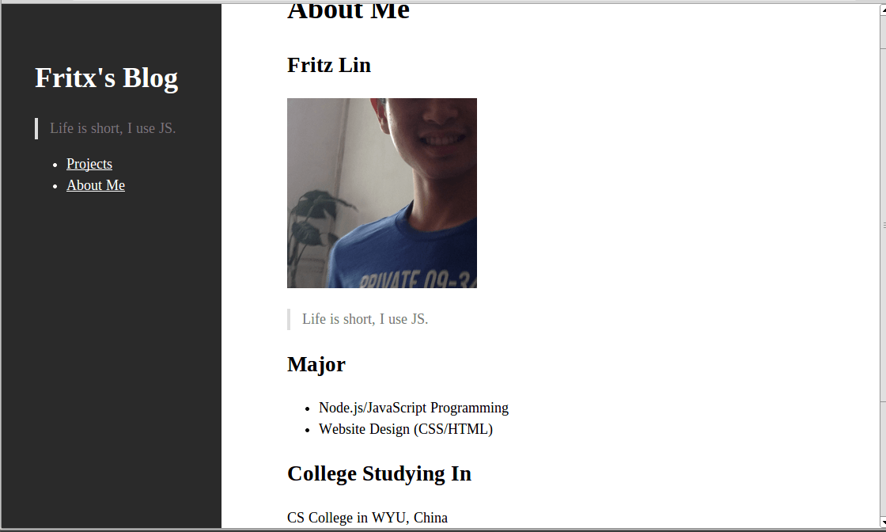

# silent one year old

*2015-05-09*

> silent不是我在github的第一个项目，但绝对是生命力最持久，收获眼球最多的一个。

（Designed by: **@huangruichang**）

[silent](.././../../projects/silent/)是什么？**silent是一款极简的轻量级静态博客框架**，拥有自己的一套载入机制和“哲学”。

silent开启了我的极简主义之路，从此一发不可收拾，我的大脑无法再接收复杂的东西。

可以说，silent伴我走过了大学里几乎是最后的一段时光，充满艰辛和回味的一年，始终和我一同成长着。从最初的宿舍楼范围内的苦力推销，到如今我欣慰地看到，silent思想被越来越多的人接纳和传扬。

那么，就让我们回顾一下silent的历程吧：

去年5月8日，我发布了[silent][1]的第一个版本，还有我自己的博客（[fritx.github.io/blog][3]）

5月9日，**@IamJayden**同学使用silent搭建了博客（[IamJayden.github.io][4]）

5月14日，**@jacsonLee**同学使用silent搭建了博客（[jacsonLee.github.io/Blog][5]）

5月19日，**@huangruichang**同学使用silent搭建了博客（[huangruichang.github.io][6]）

5月24日，路人**@7c00**使用silent搭建了博客（[7c00.github.io/b14][9]），并一度对silent进行了客观评价（值得思考）

9月11日，同事**@Derekgame2013**使用silent搭建了博客（[Derekgame2013.github.io/blog][7]）

10月14日，**@Jayin**同学发布了silent的又一分支[silentor][2]，搭建了博客（[Jayin.github.io][8]），助力silent传承。

非常感谢，silent与你同在！

&nbsp;&nbsp;

&nbsp;&nbsp;

&nbsp;&nbsp;

&nbsp;&nbsp;

&nbsp;&nbsp;

其实silent这个词（静默），跟我本人有着很大的对比。我有着一个高调的、热衷于装逼的性格。我时常为了点技术的事跟人争得不可开交，我还时常急于把尚不明确的点子与人分享，每写出一点代码，我就会大肆宣扬，巴不得所有人都看见。

但正是这种狂傲不羁的性格，驱使着我在开源的道路上不断前行。到现在，[我在github][10]已经发布了58份代码，收获57颗星，29次fork。装逼无罪，如果你足够热爱，那么请你尽情释放，做张扬的自己。

然而眼下，有那么一些事情正等着我去做，我知道，有些机会我必须把握。如果一些事情对你来说非常重要，那么也请你低调地把它做好！我是林亮，我为silent代言。

[1]: https://github.com/fritx/silent
[2]: https://github.com/Meizhuo/silentor
[3]: https://fritx.github.io/blog/
[4]: https://IamJayden.github.io
[5]: https://jacsonLee.github.io/Blog/
[6]: https://huangruichang.github.io
[7]: https://Derekgame2013.github.io/blog/
[8]: https://Jayin.github.io
[9]: https://7c00.github.io/b14/
[10]: https://github.com/fritx
