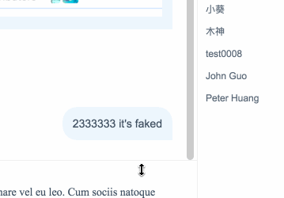

# ✋🏻 react-drag-sizing

<a href="https://fritx.github.io/react-drag-sizing/"></a>&nbsp;&nbsp;<a href="https://github.com/fritx/react-drag-sizing"></a>
&nbsp;&nbsp;<a href="https://www.npmjs.com/package/react-drag-sizing"></a>



- [x] "Drag to resize" (sizing) as React Component
- [x] Rewritten with TS & React-hooks
- [ ] Polyfill workaround with React < 16.8
- [x] Support both mouse & touch
- [x] Rollup bundle for both esm & umd
- [x] Default handlerWidth=16, handlerOffset=-w/2, handlerZIndex=10
- [x] Legacy branch: https://github.com/fritx/react-drag-sizing/tree/legacy
- [x] Live Demo: https://fritx.github.io/react-drag-sizing

```sh
npm i -S react-drag-sizing
```

```tsx
import DragSizing from 'react-drag-sizing'

<div className="chat-top"></div>
<div className="chat-body">
  <div className="chat-left">
    <MessageList />
    <DragSizing border="top">
      <Editor />
    </DragSizing>
  </div>
  <div className="chat-right">
    <DragSizing border="left">
      <MemberList />
    </DragSizing>
  </div>
</div>
```

#### Props

```tsx
export type MEvent = MouseEvent | TouchEvent;
export type RdsMEvent =
  | MouseEvent
  | (TouchEvent & {
      clientX: number;
      clientY: number;
    });

export interface DragSizingProps {
  border: 'top' | 'bottom' | 'left' | 'right';
  onStart?: (e: RdsMEvent) => void;
  onEnd?: (e: RdsMEvent) => void;
  onUpdate?: (e: RdsMEvent) => void;
  id?: string;
  className?: string;
  style?: React.CSSProperties;
  handlerClassName?: string;
  handlerStyle?: React.CSSProperties;
  handlerWidth?: number;
  handlerOffset?: number;
  handlerZIndex?: number;
  children?: React.ReactNode | undefined;
}
```

**hooking event listeners**

```tsx
handleEditorSizingStart = () => {
  // const nearBottom = scrollTop > ...
  setShouldStickToBottom(nearBottom);
};
handleEditorSizingEnd = () => {
  if (shouldStickToBottom) {
    scrollToBottom();
  }
};

<DragSizing
  border="top"
  onStart={handleEditorSizingStart}
  onEnd={handleEditorSizingEnd}
>
  <Editor />
</DragSizing>;
```

**for umd / &lt;script&gt; usage**

```html
<script src="https://unpkg.com/react"></script>
<script src="https://unpkg.com/react-dom"></script>
<script src="https://unpkg.com/react-drag-sizing"></script>
<script src="myapp.js"></script>
```

```js
// myapp.js
let React = window.React;
let ReactDOM = window.ReactDOM;
let { DragSizing } = window.ReactDragSizing;

ReactDOM.render(
  <div style={{ display: 'flex' }}>
    <sidebar style={{ flex: 1 }}>Left bar</sidebar>
    <DragSizing
      border="left"
      style={{ minWidth: '15%', maxWidth: '85%', width: '50%' }}
      handlerStyle={{ backgroundColor: 'rgba(0, 0, 0, 0.2)' }}
    >
      <main>Main content</main>
    </DragSizing>
  </div>,
  mountNode
);
```

**for react < 16.8 we need hooks polyfill workaround**

```tsx
// todo
```

---

This project was bootstrapped with [create-react-library](https://github.com/transitive-bullshit/create-react-library) & [react-ts-demo](https://github.com/fritx/react-ts-demo).
