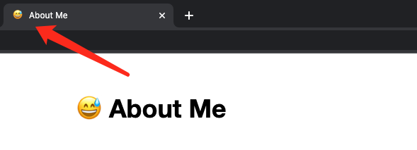

# silent 2.0

<a href="https://github.com/fritx/silent"></a>&nbsp;&nbsp;<a href="https://gitter.im/fritx"></a>&nbsp;&nbsp;<a href="https://www.npmjs.com/package/silent"></a>


> Be a silent, static blog

for silent 1.0, check [this](../silent/) out

## Features

### Old-school & Clean

- [x] no MVVM frameworks (no vue, react, etc)
- [x] no CCS frameworks
- [ ] no jquery

### Static & Portable

- [x] no node_modules (no dependencies, etc)
- [x] no build systems (no gulp, webpack, etc)
- [x] no extra build commands (no npm-run-build or -generate)
- [x] no CI/CD required (github-actions can be optional)
- [x] source code is all it needs to run
- [x] npm-create tooling

### Writing, Focus and Visualization

- [x] markdown
- [x] [mermaid](https://mermaid-js.github.io/mermaid/) diagrams

### Extendable & Integration

- [x] analytics: google, baidu, etc
- [x] comment system: [disqus](https://disqus.com) +[cusdis](https://cusdis.com) +[giscus](https://giscus.app), etc
- [ ] backend permission api

### Funny & Fancy

- [x] auto favicon (extracted from title)
- [x] favicon dark mode
- [ ] page-level dark mode




### Security & Stability

- [x] responsive design
- [ ] IE 6+ support (needs polyfill, etc)


## Usage

```sh
# create it
npm create silent <dest>
# or
npm i -g silent
silent create <dest>

# e.g.
npm create silent ~/t/my-blog
# >>>
# copying /Users/fritx/.nvm/versions/node/v16.14.0/lib/node_modules/silent/blog
#  => /Users/fritx/t/my-blog
# silent-create completed

# serve it
cd ~/t/my-blog
npx serve . -p 3000
# >>>
# Serving! http://localhost:3000

# deploy to your github pages?
cd ~/t/my-blog
git init
git remote add origin git@github.com:fritx/silent.git
npx gh-pages -d .
# >>>
# Published. https://fritx.github.io/silent/
```

## Browser Compatibility

Status: no IE

- [ ] no IE https://caniuse.com/?search=arr%20includes
- [ ] no IE https://caniuse.com/?search=str%20includes
- [ ] IE10+ https://caniuse.com/?search=console
- [ ] IE9+ https://caniuse.com/?search=arr%20foreach
- [ ] IE9+ https://caniuse.com/?search=querySelector
- [ ] IE9+ https://caniuse.com/?search=css3%20selectors

auto title favicon:

- [x] no IE https://caniuse.com/?search=prefers-color-scheme
- [x] IE10+ https://caniuse.com/?search=matchMedia
- [ ] IE9+ https://caniuse.com/?search=canvas

if using giscus:

- [ ] IE8+ https://caniuse.com/?search=localstorage

## Silent Fans

> Thank you!

- [Meizhuo's Blog](https://meizhuo.github.io/blog/)
- [Amen's Blog](https://linzx89757.github.io/blog/)
- [Jayin's Blog](https://v1.jayinton.com/blog/)
- [Derek's Blog](https://derekgame2013.github.io/blog/)
- [Huang's Blog](https://huangruichang.github.io)
- [Jason's Blog](https://jacsonlee.github.io/Blog/)
- [Jayden's Blog](https://iamjayden.github.io)
- [Fritx' Blog](https://blog.fritx.me/)

## More..

> Rather than a framework or library, silent is more like a spirit - a culture. (says Huang)

- [Silent One Year Old](?2015/05/silent-one-year-old)
- ~~[Silent T-Shirt](http://udz.com/silent)~~


