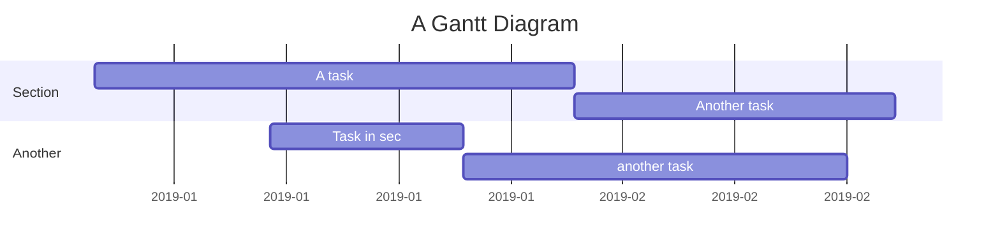
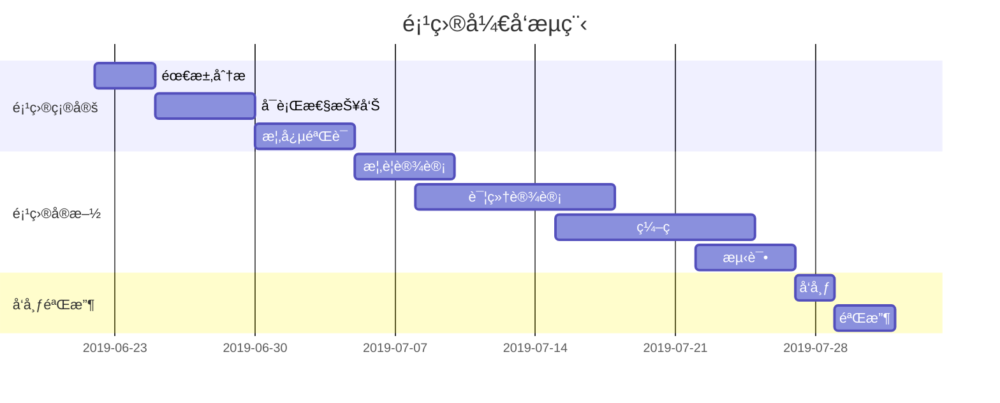

# 🔠Reports

```mermaid
gantt
  title A Gantt Diagram
  axisFormat %Y-%m
  section Section
  A task           :a1, 2019-01-01, 30d
  Another task     :after a1  , 20d
  section Another
  Task in sec      :2019-01-12  , 12d
  another task     : 24d
```

```mermaid
gantt
  title 项目开å‘æµç¨‹
  section 项目确定
    éœ€æ±‚åˆ†æ       :a1, 2019-06-22, 3d
    å¯è¡Œæ€§æŠ¥å‘Š     :after a1, 5d
    æ¦‚å¿µéªŒè¯       : 5d
  section 项目å®æ–½
    概è¦è®¾è®¡      :2019-07-05  , 5d
    详细设计      :2019-07-08, 10d
    ç¼–ç           :2019-07-15, 10d
    测试          :2019-07-22, 5d
  section å‘布验收
    å‘布: 2d
    验收: 3d
```
